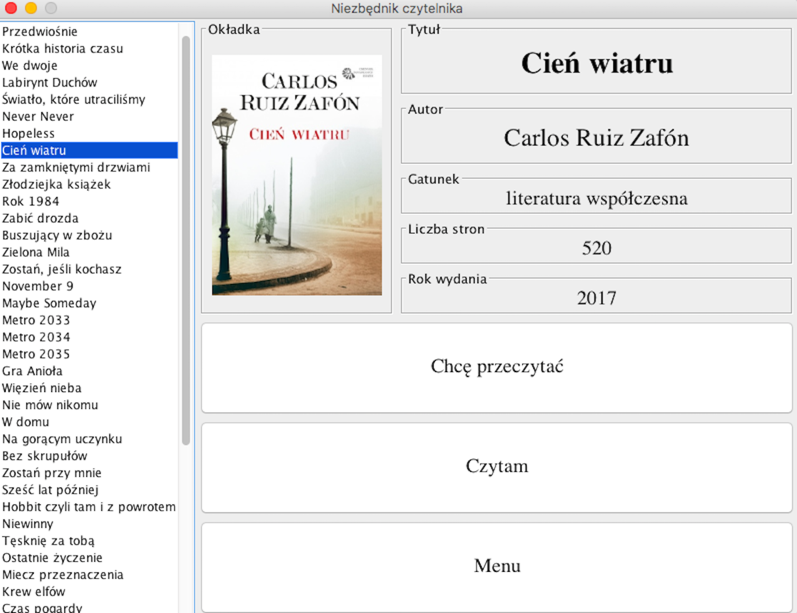

# OOP - Project

## Opis apikacji
Niezbędnik czytelnika jest aplikacją okienkowa napisaną w języku Java przy użyciu biblioteki
Swing, która umożliwia obsługę interfejsu okienkowego. Aplikacja jest projektem semestralnym
z programowania obiektowego na zajęcia w Instytucie Informatyki UWr(Lato 2018). Program jest przeznaczony
dla osób lubiących czytać i upamiętniać przeczytane przez siebie książki.

Aplikacja składa się z pięciu okien.

* `Okno główne` - jest to podstawowe okno menu, zawiera logo aplikacji i cztery przyciski,
które automatycznie po kliknięciu przenoszą do odpowiednich okien.

* `Baza książek` - jest to okno, w którym wyświetlana jest cała podstawowa baza książek.
Po prawej stronie wyświetlany jest interfejs zaznaczonej książki i panel z przyciskami pozwalający
użytkownikowi wykonać trzy operacje (przeniesienie książki do bazy książek do
przeczytania, zaznaczenie, że książka jest w chwili obecnej czytana oraz powrót do okna
głównego).

* `Baza książek do przeczytania` - jest to okno, w którym wyświetlana jest lista książek,
które użytkownik zaznaczył jako te, które chce przeczytać. Po prawej stronie (tak jak w
poprzednim oknie) wyświetlany jest interfejs zaznaczonej książki i panel z przyciskami
pozwalający użytkownikowi wykonać trzy operacje (zaznaczenie, że książka jest w chwili
obecnej czytana, ocenienie książki i przeniesienie do bazy książek przeczytanych oraz powrót
do okna głównego).

* `Baza książek czytanych` - jest to okno, w którym wyświetlana jest lista książek, które
użytkownik zaznaczył jako te, które czyta. Po prawej stronie (tak jak w poprzednich
oknach) wyświetlany jest interfejs zaznaczonej książki i panel z przyciskami pozwalający
użytkownikowi wykonać trzy operacje (wprowadzenie liczby przeczytanych stron i zobaczenie
jaki postęp w czytaniu został wykonany, ocenienie książki i przeniesienie do bazy
książek przeczytanych oraz powrót do okna głównego).

* `Baza książek przeczytanych` - jest to okno, w którym wyświetlana jest lista książek,
które użytkownik zaznaczył jako te, które przeczytał. Po prawej stronie (tak jak w poprzednich
oknach) wyświetlany jest interfejs zaznaczonej książki i panele z informacjami o ocenie
jaką wystawił użytkownik i data przeczytania danej książki. Na dole okna umieszczony jest
przycisk, który służy do powrotu do okna głównego aplikacji.

## Screenshots

*Okno główne*

*Baza książek*

*Baza książek do przeczytania*

*Baza książek czytanych*

*Baza książek przeczytanych*
